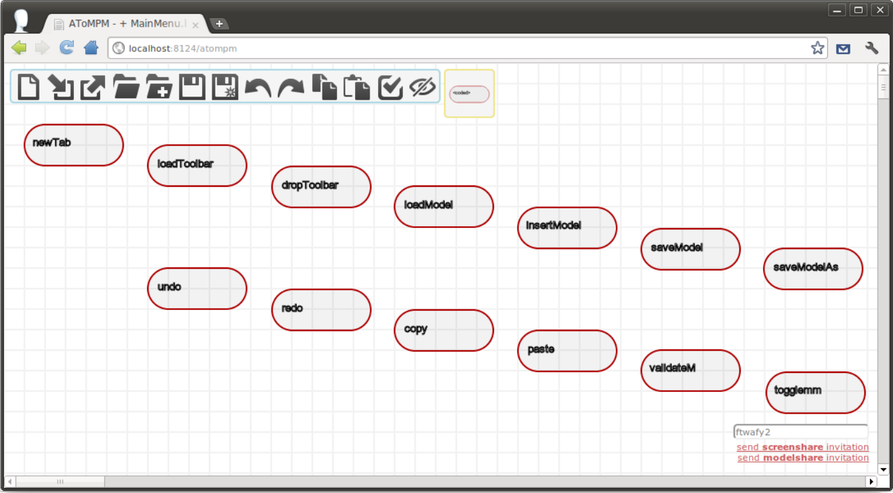

.. _creating_buttons_and_plugins:

Creating Buttons and Plugins
============================

Creating Button Toolbar Models
------------------------------

Button toolbar models are a special kind of model in the sense that they can be loaded as models *and* as toolbars. Example button models are provided under *Toolbars*.

    
The figure above shows the model that defines the MainMenu button toolbar. Each entity of the *Button* type has three attributes: *name*, *tooltip* and *code*.

* *name* is displayed in concrete syntax and is used to resolve the file name of the button's associated toolbar icon: given *name* N, there should be an icon named n.icon.png in the same folder as the model.

* *tooltip* becomes the icon's tooltip, i.e., hovering the mouse cursor over a button's toolbar icon displays the value of its *tooltip* attribute.

* *code* is a code snippet that is evaluated when the toolbar icon is clicked. This code must be valid JavaScript and can make use of the AToMPM Client API, detailed in the following Subsection.

Finally, the layout of *Button* entities dictates their order in the toolbar: higher and leftmost buttons are shown first.

Plugins
-------

Plugin files are written in Javascript and placed in the *plugins/* folder. These plguins functions or classes can then be accessed by button or transformation code within AToMPM.

Client API
----------

The following functions can be accessed from within the *code* attribute of *Button* entities in button toolbar models and from the Console.

Note that several button toolbar models which make exhaustive use of these functions are provided under */Toolbars/*.

*function _compileToASMM(fname)*
    Compile a model, specified by its full path (relative to the current user's trunk), into an abstract syntax meta-model. An error message will be produced if the specified model is not a model of a formalism's abstract syntax. As of now, such models may only be expressed in the bundled *SimpleClassDiagram* or *EntityRelationship* formalisms. Also, note that a recommended (but not enforced) naming convention is that models of formalism abstract syntax be named ``FORMALISM_NAMEMM.model``.

*function _compileToCSMM(fname)*
    Compile a model, specified by its full path (relative to the current user's trunk), into a concrete syntax (or icon definition) meta-model. An error message will be produced if the specified model is not a model of a formalism's concrete syntax. As of now, such models may only be expressed in the bundled *ConcreteSyntax* formalism. Note that enforced naming conventions are that models of formalism concrete syntax must be named ``FORMALISM_NAME.DESCRIPTIONIcons.model``, and that exactly one concrete syntax definition should be named ``FORMALISM_NAME.defaultIcons.model``.

*function _compileToPatternMM(fname)*
    Produce pattern abstract and concrete syntax meta-models given an abstract syntax meta-model, specified by its full path (relative to the current user's trunk). An error message will be produced if the specified meta-model is not an abstract syntax meta-model.

*function _copy()*
    Copy selected entities (if any). Note that it is impossible to copy edges if any of their extremities aren't also selected.

*function _exportSVG(fname)*
    Prompt the user to download an SVG image representation of the current model and save it under the given filename. When *fname* is omitted, target filename defaults to ``model.svg``.

*function _getUserPreferences(callback[,subset])*
    Call *callback* with the contents of the logged in user's preferences file (see Section :ref:`userprefs`), or a subset of it. When *subset* is defined, it should be an array of desired user's preference keys.

*function _httpReq(method,url,params,onresponse[,sync])*
    Perform a synchronous or asynchronous HTTP request given an HTTP method (GET, PUT, POST or DELETE), a URL, a key-value dictionary of parameters, and a function that should handle the request's response. The *onresponse* function should expect two parameters: *statusCode* and *responseData*.

*function _insertModel(fname)*
    Load a model, specified by its full path (relative to the current user's trunk), alongside the current model.

*function _loadModel(fname)*
    Load a model, specified by its full path (relative to the current user's trunk), overwriting the current model, if any.

*function _loadToolbar(fname)*
    (Re-)Load one or more button or formalism toolbars, specified by their full path (relative to the current user's trunk).

*function _openDialog(type,args,callback)*
    Pop-up a dialog box for user interaction. Valid values for the \texttt{type} parameter are \texttt{\_CLOUD\_DATA\_MANAGER}, \texttt{\_DICTIONARY\_EDITOR}, \texttt{\_ENTITY\_EDITOR}, \texttt{\_ERROR}, \texttt{\_FILE\_BROWSER}, \texttt{\_LEGAL\_CONNECTIONS}, \texttt{\_LOADED\_TOOLBARS} and \texttt{\_CUSTOM}. Each type requires its own set of arguments encoded in the \texttt{args} parameter. As for the \texttt{callback} parameter, it is a one-argument function called with the sum of the user's input when and if the user ``OK''es the dialog.\\

The \texttt{\_CLOUD\_DATA\_MANAGER} dialog is used to manage user data stored within the user's personal cloud space. Its \texttt{args} parameter should be a key-value dictionary with the following optional keys: ``extensions'', ``readonly'' and ``title''. Values for the ``extensions'' key should be arrays of regular expressions describing allowed file names. When omitted, all file names are allowed. Values for the ``readonly'' key should be booleans denoting  whether or not the provided dialog should allow cloud data modifications. When omitted, modifications are allowed. Finally, the ``title'' argument is a string that denotes the dialog's title.\\

The \texttt{\_DICTIONARY\_EDITOR} dialog is used to read and edit arbitrary \textit{typed} dictionaries\footnote{See Section~\ref{ssec:types} for an example of a \textit{typed} dictionary.}. Its \texttt{args} parameter should be a key-value dictionary of the form:
\begin{verbatim}
    {
        data  	       : ``< a typed dictionary >'',
        ignoreKey      : ``< a function that takes 2 parameters, a key and a value, and 
                             returns true if they should be shown in the editing dialog >'',
        keepEverything : ``< a function that returns false if only updated key-value pairs 
                             should be remembered by the editing dialog >'',
        title          : ``< an optional dialog's title >		                             
    }
\end{verbatim}

The \texttt{\_ENTITY\_EDITOR} dialog is used to read and edit abstract entity attributes. Its \texttt{args} parameter should be a key-value dictionary of the form:
\begin{verbatim}
    {
        uri  :  ``< some entity URI >''
    }
\end{verbatim}

The \texttt{\_ERROR} dialog is used to report an error (e.g., attempting to connect elements that can not be connected) to the user. Its \texttt{args} parameter should be a string of text describing the error.\\

The \texttt{\_FILE\_BROWSER} dialog is used to browse and select files stored within the user's personal cloud space. Its \texttt{args} parameter should be a key-value dictionary with the following optional keys: ``extensions'', ``multipleChoice'', ``manualInput'' and ``title''. Values for the ``extensions'' key should be arrays of regular expressions describing allowed file names. When omitted, all file names are allowed. Values for the ``multipleChoice'' key should be booleans denoting whether or not several files can be selected simultaneously. When omitted, only one file can be selected at a time. Values for the ``manualInput'' key should be booleans denoting  whether or not manual file name entry should be permitted. When omitted, manual file name entry is disabled. Finally, the ``title'' argument is a string that denotes the dialog's title.\\

The \texttt{\_LEGAL\_CONNECTIONS} dialog is used to provide the user with a choice of legal connection types between entities he/she is trying to connect when more than one such connection type is available. Its \texttt{args} parameter should be a key-value dictionary of the form:
\begin{verbatim}
    {
        uri1          :  ``< source entity URI >'', 
        uri2          :  ``< target entity URI >'', 
        ctype         :  ``containment'' | ``visual'',
        forceCallback : true | false
    }
\end{verbatim}
The \texttt{forceCallback} argument indicates whether or not the dialog callback function should be called in the event where no legal connections are available. When unset, the default behaviour is to pop up an error.\\

The \texttt{\_LOADED\_TOOLBARS} dialog is used to select loaded button and formalism toolbars. Its \texttt{args} parameter should be a key-value dictionary with the following keys: ``multipleChoice'', ``type'' and ``title''. Values for the ``multipleChoice'' key should be booleans denoting whether or not several toolbars can be selected simultaneously. Values for the ``type'' key should be \texttt{``metamodels''}, \texttt{``buttons''} or \texttt{undefined}. Finally, the optional ``title'' argument is a string that denotes the dialog's title.\\

Last but not least, the \texttt{\_CUSTOM} dialog enables entirely user-specified dialogs. Its \texttt{args} parameter should be a key-value dictionary of the form:
\begin{verbatim}
    {
        widgets  :  [ < ..., widgetDescription_i, ... > ]
        title    : ``< an optional dialog's title >		                             
    }
\end{verbatim}
where $widgetDescription\_i$s have the form
\begin{verbatim}
    {
        id       :  ``< widgetId >'',
        type     :  ``input'',
        label    :  ``< input label >'',
        default  :  ``< default value in input field >''
    }
\end{verbatim}
for input fields, and
\begin{verbatim}
    {
        id              :  ``< widgetId >'',
        type            :  ``select'',
        choices         :  [ < ..., ``< choice_i >'', ... > ],
        multipleChoice  :  true | false
    }
\end{verbatim}
for lists of choices.
\vspace*{1em}

\addcontentsline{toc}{subsubsection}{\quad \texttt{function \_paste()}}
\begin{center}	{\large \texttt{function \_paste()}} \end{center}

Paste copied entities (if any). Note that copied entities may originate from another AToMPM client.\\
\vspace*{1em}

\addcontentsline{toc}{subsubsection}{\quad \texttt{function \_redo()}}
\begin{center}	{\large \texttt{function \_redo()}} \end{center}

Redo the last undone action.\\
\vspace*{1em}

\addcontentsline{toc}{subsubsection}{\quad \texttt{function \_saveModel([fname,backup])}}
\begin{center}	{\large \texttt{function \_saveModel([fname,backup])}} \end{center}

Persist a model, specified by its full path (relative to the current user's trunk), to the user's personal cloud space. If the \texttt{backup} flag is set, the provided filename will not be set as the current filename, and the window title will not be altered to indicate that changes have been saved. \\
\vspace*{1em}

\addcontentsline{toc}{subsubsection}{\quad \texttt{function \_setInvisibleMetamodels(mms)}}
\begin{center}	{\large \texttt{function \_setInvisibleMetamodels(mms)}} \end{center}

Make all entities from the given formalisms, specified via their full paths (relative to the current user's trunk), invisible.\\
\vspace*{1em}

\addcontentsline{toc}{subsubsection}{\quad \texttt{function \_setUserPreferences(prefs[,callback])}}
\begin{center}	{\large \texttt{function \_setUserPreferences(prefs[,callback])}} \end{center}

Update the logged in user's preferences file (see Section \ref{ssec:prefs}). \texttt{prefs} should be a key-value dictionary. Note that \texttt{prefs} need not contain keys and values for all existing user preference keys: missing keys will retain their current value.\\
\vspace*{1em}

\addcontentsline{toc}{subsubsection}{\quad \texttt{function \_setTypeToCreate(fulltype)}}
\begin{center}	{\large \texttt{function \_setTypeToCreate(fulltype)}} \end{center}

Set the type of entities that will be created when the user creates new entities on the Canvas.\\
\vspace*{1em}

\addcontentsline{toc}{subsubsection}{\quad \texttt{function \_spawnClient(fname,callbackURL)}}
\begin{center}	{\large \texttt{function \_spawnClient(fname,callbackURL)}} \end{center}

Spawn a new instance of AToMPM. If a model is specified via the \texttt{fname} parameter, it is loaded into the new instance. If a callback url is specified via the \texttt{callbackURL} parameter, critical information about the new instance is POSTed to it upon its creation.\\
\vspace*{1em}

\addcontentsline{toc}{subsubsection}{\quad \texttt{function \_spawnHeadlessClient(context,onready,onchlog)}}
\begin{center}	{\large \texttt{function \_spawnHeadlessClient(context,onready,onchlog)}} \end{center}

\TBC.\\
\vspace*{1em}

\addcontentsline{toc}{subsubsection}{\quad \texttt{function \_undo()}}
\begin{center}	{\large \texttt{function \_undo()}} \end{center}

Undo the last performed action.\\
\vspace*{1em}

\addcontentsline{toc}{subsubsection}{\quad \texttt{function \_unloadToolbar(tb)}}
\begin{center}	{\large \texttt{function \_unloadToolbar(tb)}} \end{center}

Close one or more of the loaded button and formalism toolbars, specified via their full paths (relative to the current user's trunk).\\
\vspace*{1em}

\addcontentsline{toc}{subsubsection}{\quad \texttt{function \_validate()}}
\begin{center}	{\large \texttt{function \_validate()}} \end{center}

Verify abstract syntax validity constraints (if any) for all loaded formalisms.\\

%%%%%%%%%%%%%%%%%%%%%%%%%%%%%%%%%%%%%%%%%%%%%%%%%%%%%%%%%%%%%%%
\subsection{Remote API}
AToMPM also supports a limited ``Remote API'' that can be used to edit and animate models remotely, e.g., from third-party or synthesized applications. This is achieved by forwarding specially formatted HTTP queries targeted at the back-end to the client. The said queries must have the form:
\begin{verbatim}
    method  :  ``PUT''
    url     :  ``< backendURL >/GET/console?wid=< aswid >''
    data    :  {``text'': ``CLIENT_BDAPI :: < func >''}
\end{verbatim}
where $aswid$ is an identifier for the client's associated back-end abstract syntax thread (retrievable by typing \texttt{\_\_aswid} in the client Console), and $func$ is a string representation of a key-value dictionary of the form:
\begin{verbatim}
    {
        func    :  ``< Remote API function name >'',
        args  :  { < ..., < arg_i : value_i >, ... > }
    }
\end{verbatim}

The methods accessible via the Remote API are detailed below.\\

\addcontentsline{toc}{subsubsection}{\quad \texttt{function \_highlight(args)}}
\begin{center}	{\large \texttt{function \_highlight(args)}} \end{center}
\begin{verbatim}
  args = 
    {
        asid                       :  ``< abstract syntax entity identifier >'',
        followCrossFormalismLinks  :  undefined | ``*'' | ``DOWN'' | ``UP'',
        timeout                    :  undefined | < timeout >
    }
\end{verbatim}

Highlight the given entity, specified via its abstract syntax identifier, and un-highlight any highlighted nodes. The \texttt{followCrossFormalismLinks} parameter indicates whether or not (and which) neighbours along cross-formalism links should also be highlighted. The \texttt{timeout} parameter, if specified, indicates the duration of the highlight (in milliseconds).\\
\vspace*{1em}

\addcontentsline{toc}{subsubsection}{\quad \texttt{function \_loadModelInNewWindow(args)}}
\begin{center}	{\large \texttt{function \_loadModelInNewWindow(args)}} \end{center}
\begin{verbatim}
  args = 
    {
        fname         :  ``< model file name >'',
        callback-url  :  ``< callback URL >''
    }
\end{verbatim}

A Remote API wrapper around the Client API \texttt{\_spawnClient()} function.\\
\vspace*{1em}

\addcontentsline{toc}{subsubsection}{\quad \texttt{function \_tag(args)}}
\begin{center}	{\large \texttt{function \_tag(args)}} \end{center}
\begin{verbatim}
  args = 
    {
        asid     :  ``< abstract syntax entity identifier >'',
        text     :  ``< text to display >'',
        style    :  { < ..., ``< key_i : value_i >'', ...> },
        append   :  true | false,                
        timeout  :  undefined | < timeout >
        
    }
\end{verbatim}

Tag the given entity, specified via its abstract syntax identifier, with appropriately styled text \TBC, appending or overwriting existing tags. The \texttt{timeout} parameter, if specified, indicates how long the tag should be displayed (in milliseconds).\\
\vspace*{1em}

\addcontentsline{toc}{subsubsection}{\quad \texttt{function \_updateAttr(args)}}
\begin{center}	{\large \texttt{function \_updateAttr(args)}} \end{center}
\begin{verbatim}
  args = 
    {
        asid       :  ``< abstract syntax entity identifier >'',
        attr       :  ``< abstract attribute name >'',
        val        :  < new abstract attribute value >,
        highlight  :  true | false        
    }
\end{verbatim}

Update an attribute of the given entity, specified via its abstract syntax identifier, possibly briefly highlighting the entity to draw attention to the change.\\

