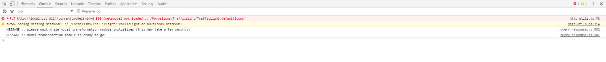
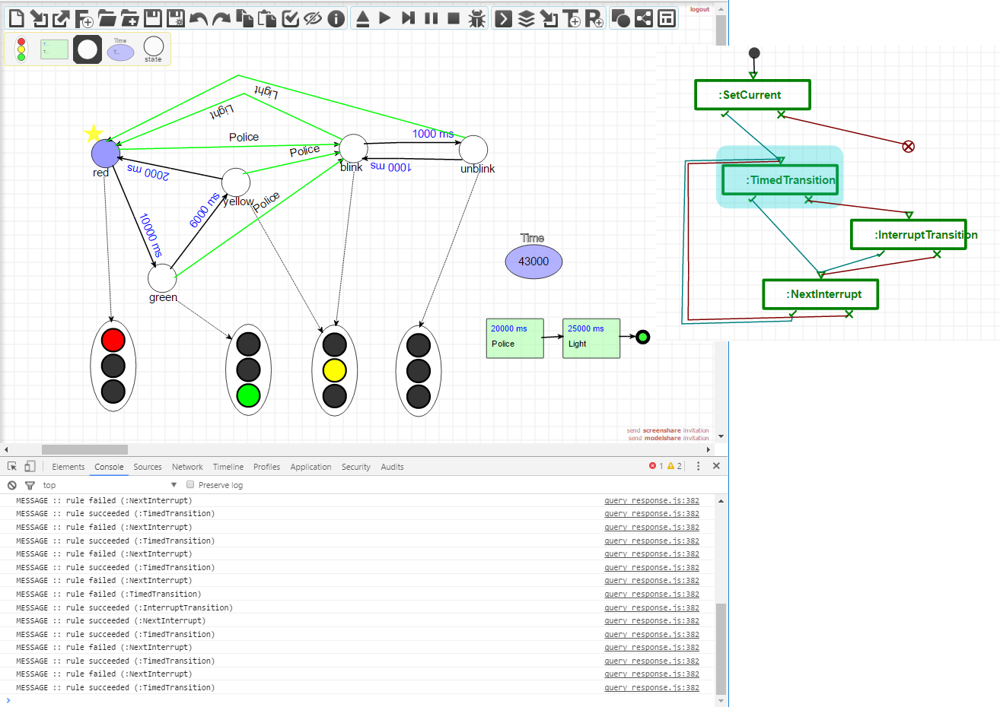

.. _executing-a-model-transformation:

Executing a Model Transformation
================================

The *TransformationController* toolbar is used to execute a model transformation.

.. image:: img/transformation_controller.png

The first button allows you to load a model transformation (schedule). The file browser will only allow you to load models that start with the *T_* prefix.

Look in the console to see whether the transformation was correctly loaded:

From that point, you can use the four control buttons to start, step throug, pause and stop a transformation. The console will log which rules were tried and whether they succeeded or failed.

.. warning:: If you want to restart a transformation, please *reload* the current AToMPM instance or start a new one.

AToMPM supports the debugging of model transformation schedules. To enable debugging, press the last button of the *TransformationController* toolbar. When debugging is enabled, and you press play, a window will pop up containing the model of the schedule.

