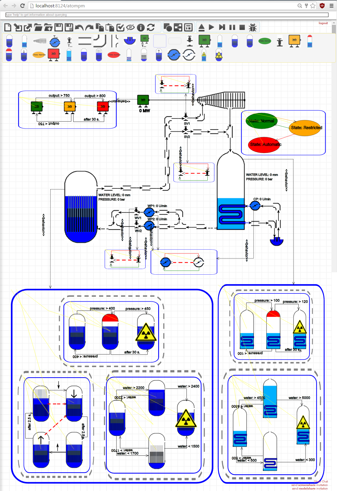

AToMPM Documentation
====================
AToMPM ("A Tool for Multi-Paradigm Modelling") is a (meta)modelling workbench, which allows language developers to create visual domain-specific languages, and domain experts to use these languages. A language is defined by its *abstract syntax* in a metamodel, its *concrete syntax(es)*, which define(s) how each abstract syntax element is visualized, and its *semantics definition(s)*, either operational (a simulator) or translational (by mapping onto a known semantic domain). AToMPM supports model transformations to model semantics.

This documentation serves to introduce AToMPM to the two main user groups: language developers and language users. 

For up-to-date installation and usage instructions, please read the README file in the AToMPM root directory, or online at `https://github.com/AToMPM/atompm#readme <https://github.com/AToMPM/atompm#readme>`_

AToMPM Website: `https://atompm.github.io/ <https://atompm.github.io/>`_

Source code: `https://github.com/AToMPM/atompm <https://github.com/AToMPM/atompm>`_

Documentation: `https://atompm.readthedocs.io/ <https://atompm.readthedocs.io/>`_

Issues/Feedback: `https://github.com/AToMPM/atompm/issues <https://github.com/AToMPM/atompm/issues>`_

    
Contents
--------

.. toctree::
    :maxdepth: 3

    Overview <overview>
    Creating a Modelling Language <new_language>
    Using a Modelling Language <using_language>
    Modelling a Model Transformation <modelling_transformation>
    Executing a Model Transformation <executing_transformation>
    Collaboration <collaboration>
    Workflows <workflows>
    Creating Buttons and Plugins <creating_buttons_and_plugins>
    Toolbar/Plugin Documentation <toolbars_and_plugins>
    Troubleshooting <troubleshooting>

Licensing
---------

The AToMPM project is licensed under the LGPL as stated in COPYING.lesser.

AToMPM is copyright of the AToMPM team, which includes Raphael Mannadiar, Conner Hansen, Eugene Syriani, Hans Vangheluwe, Simon Van Mierlo, Huseyin Ergin, Jonathan Corley, Yentl Van Tendeloo, Vasco Sousa, and Bentley James Oakes
