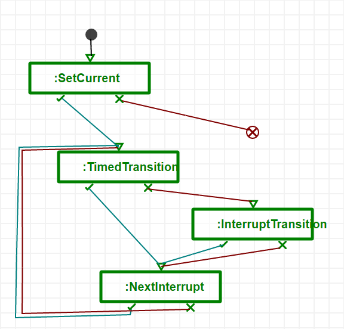

.. _modelling-a-model-transformation:

Modelling a Model Transformation
================================
A model transformation consists of a set of rules that match and rewrite parts of the model, and a schedule that governs the order in which rules are executed. In the next subsections, we explain how to create these elements. In :ref:`executing-a-model-transformation`, we explain how to execute the modelled transformation.

In this section, we make use of the *TransformationEditor* toolbar:

.. image:: img/transformation_editor.png

Compiling a Language to a Pattern Language
------------------------------------------
A prerequisite to modelling rules is to compile the language of the models you want to transform to a pattern language. This pattern language is used in the rules you model, and is very similar to the original language. This makes modelling the patterns very intuitive (since almost the same syntax is used), while changing the language to accomodate the matching and rewriting process.

.. image:: img/compilation_toolbar.png

To compile a language to a pattern language, press the third button on the *CompileMenu* toolbar. Navigate to the abstract syntax metamodel you want to compile:

Pressing the 'ok' button will create the abstract syntax metamodel *TrafficLight.pattern.metamodel* and the formalism toolbar *TrafficLight.defaultIcons.pattern.metamodel* in the */Formalisms/TrafficLight* user folder. This formalism is used alongside :ref:`the-rule-language` to model the rules of the model transformation. The pattern language differs from the original language in three ways:

* Its constraints are **relaxed**. More precisely, abstract classes in the original language are made concrete, and minimum cardinalities are removed.
* Elements in the language are **augmented** with four attributes: *__pLabel*, *__pMatchSubtypes*, *__pPivotIn*, and *__pPivotOut*. We will only use the two first ones. *__pLabel* is used to identify elements across LHS/RHS/NAC patterns, and *__pMatchSubtypes* indicates that instances of subclasses should also be matched.
* The type of the attributes of each element is changed to *code*. This allows to model *constraints* in LHS/NAC patterns on the values of the attributes in the host model and *actions* in RHS patterns to compute the new values of the attributes after rewriting.

.. warning:: Constraint and action code in patterns is written in Python!

Initializing Schedules/Rules
----------------------------
A formalism created with the "new formalism" button on the *MainMenu* toolbar (see :ref:`overview`) comes initialized with two schedules: *OperationalSemantics/T_OperationalSemantics.model* and *TranslationalSemantics/T_TranslationalSemantics.model*. These can be used to model the schedule of the formalism's operational semantics (a simulator) and translational semantics (a mapping onto a domain with known semantics), respectively.

If you want to initialize a new schedule, use the fourth button on the *TransformationEditor* toolbar. This will present you with a file browser, which allows you to choose a location and a name for the schedule. The schedule will automatically open in a new AToMPM instance.

.. warning:: A schedule's name has to start with the T\_ prefix!

If you want to initialize a new rule, use the fifth button on the *TransformationEditor* toolbar. This will present you with a file browser, which allows you to choose a location and a name for the rule. The rule will automatically open in a new AToMPM instance.

.. warning:: A rule's name has to start with the R\_ prefix!

.. _the-rule-language:

The Rule Language
-----------------
When creating a rule, it is initialized with the three basic components of every rule: a *Negative Application Condition* (NAC), a *Left-Hand-Side* (LHS), and a *Right-Hand-Side* (RHS).

In general, a rule has to have exactly one LHS, exactly one RHS, and zero or more NACs. The LHS is used to *match a pattern* in the host model. It is a positive application condition: if the pattern is found in the host model, the rule can be applied. If the pattern in one of the NACs is found, however, the rule is disabled. The RHS is used to *rewrite the pattern* in the host model.

To model the patterns, we need to load the pattern language we compiled earlier. Press the third button on the *TransformationEditor* toolbar. Navigate to your pattern metamodel:

This will load the formalism toolbar of the pattern language for use in LHS, RHS, and NAC patterns.

LHS and NAC
^^^^^^^^^^^
The LHS and NACs are so-called *precondition patterns*. When a rule is selected for execution, it will try to find a match in the host model for the LHS. If one is found, it will try to match all the NACs. If a match is found for one of them, the rule is not executed.

.. image:: img/example_LHS.png

In the example LHS above, we try to find the current interrupt in the interrupt list, but only if the clock has advanced to a point in time *after or equal to* the time specified in that interrupt. To do this, we model:

* An instance of *__pInterrupt* (with label '1'). Each attribute has to assign a boolean value to the 'result' variable, indicating whether the instance can be matched based on the value of the attribute. The current value can be accessed using the *getAttr()* function. For a complete overview of functions that can be called from action and condition code in patterns, see :ref:`mt-action-library`. In our example, we only want to make sure the *current* attribute is *True*. We set all conditions to *result = True* (the default), except for the *current* attribute, where we require *result = (getAttr() == True)* -- or, more simply, *result = getAttr()*.
* An instance of the *AbstractInterrupt*, connected to the first interrupt. We instantiate the abstract class here, because potentially, it is the *end* of the list, and we want to make sure to match both normal interrupts and end interrupts.
* The *Time* instance (which we know is a singleton).

The condition that the clock needs to have advanced beyond the time specified in the current interrupt cannot be modelled as a condition on one single attribute, since it spans multiple instances (the *Time* instance and the first *Interrupt* instance). A precondition pattern also allows a global condition, which needs to be satisfied in order for the pattern to match. In this case, we get the current time, the event time, and compare them. Again, the resulting boolean is assigned to the variable *result*.

When executing the transformation, AToMPM will try to find a match for each of the pattern elements. If one is found, it will map each *__pLabel* value to a matched element::

    {
       '0': <AbstractInterrupt Instance>
       '1': <Interrupt Instance>
       '2': <Next Instance>
       '3': <Time Instance>
    }

This is called a binding. AToMPM will find as many matches as possible. This results in a match set.
    
RHS
^^^
The RHS is the *postcondition pattern*. It specifies how the elements matched by the LHS should be rewritten. In general:

* Elements in the RHS with a *__pLabel* that cannot be found in the LHS are created.
* Elements in the LHS with a *__pLabel* that cannot be found in the RHS are deleted.
* Elements in the RHS with a *__pLabel* that can be found in the LHS are updated according to the actions modelled in the RHS.

.. image:: img/example_RHS.png

The task of the right-hand side of our rule is to change the current interrupt to the next one. The *result* attribute now should get the new value of the attribute. If nothing needs to change, one can simply write *result = getAttr()*. In this case, the *current* attribute of the first interrupt is changed to *False*, while the *current* attribute of the second interrupt is changed to *True*. The rest of the attributes remains unchanged. For a complete overview of functions that can be called from action and condition code in patterns, see :ref:`mt-action-library`.

The MoTif Scheduling Language
-----------------------------

Rules are scheduled using a scheduling language. We use *MoTif*, which exposes a number of primitives, or *steps*. A schedule consists of a number of steps starting at the *Start* pseudostep and ending in either a *EndSuccess* or *EndFail* pseudostep. Each step is connected to two other steps with a *success* or a *fail* link. Depending on the type of step, the referenced rule(s) are executed in a particular way. The steps exposed by MoTif are:

.. image:: img/MoTif_toolbar.png

#. **ARule**: Atomic rule. Executes the rule for one match found. If no matches are found, it fails.
#. **QRule**: A query. Succeeds if the LHS matches and the NACs do not match. The RHS of the rule is ignored.
#. Unused.
#. Unused.
#. **FRule**: For-all rule. Executes the rule for each match in the match set. It fails if no matches can be found.
#. **SRule**: Sequence rule. Executes the rule until no more matches can be found. It fails if no matches can be found.
#. **Start**: The start of the schedule. Can only appear once.
#. **EndSuccess**: The end of the schedule (indicating success). Can occur more than once, but the schedule ends when one of them is reached.
#. **EndFail**: The end of the schedule (indicating failure). Can occur more than once, but the schedule ends when one of them is reached.
#. **Sequence**: Executes the referenced transformation until it fails.
#. **BRule**: Allows for other steps to be nested. Executes (non-deterministically) one of the succeeding child steps.
#. **CRule**: Nested transformation. The referenced transformation schedule is executed once.
#. **BSRule**: Executes (non-deterministically) one of the succeeding child steps until none of them succeeds.
#. Unused.
#. Unused.
#. Unused.
#. Unused.

.. _mt-action-library:

Action Library
--------------

.. rst-class:: table-with-borders

.. note:: The *_id* attribute can either be an abstract syntax identifier, or a *__pLabel* value.

.. note:: The notion of full types is best explained by example: the full type of a SimpleClassDiagram.Class entity is "/Formalisms/__LanguageSyntax__/SimpleClassDiagram/SimpleClassDiagram/Class".

+----------------------------------------+-------------------------------------+-------------------------------------------------------------------------------+
| name                                   | parameters                          | Description                                                                   |
+========================================+=====================================+===============================================================================+
| getAttr(_attr[, _id])                  | * *_attr*: string                   | Return the value of the given attribute from the given entity, specified      |
|                                        | * *_id*: string                     | via its abstract syntax identifier or __pLabel. If no such attribute exists,  |
|                                        |                                     | the current constraint, action, mapper, or parser is immediately interrupted  |
|                                        |                                     | and an error is presented to the user.                                        |
+----------------------------------------+-------------------------------------+-------------------------------------------------------------------------------+
| hasAttr(_attr[, _id])                  | * *_attr*: string                   | Returns *true* if the given entity, specified via its abstract syntax         |
|                                        | * *_id*: string                     | identifier or __pLabel, has an attribute named *attr*, *false* otherwise.     |
+----------------------------------------+-------------------------------------+-------------------------------------------------------------------------------+
| getAttrNames(_id)                      | * *_id*: string                     | Return all attribute names of the given entity, specified via its abstract    |
|                                        |                                     | syntax identifier or __pLabel.                                                |
+----------------------------------------+-------------------------------------+-------------------------------------------------------------------------------+
| getAllNodes(_fulltypes)                | * *_fulltypes*: list<string>        | Return the abstract syntax identifiers of all entities whose types are        |
|                                        |                                     | contained within the fulltypes array. If it is omitted, return the abstract   |
|                                        |                                     | syntax identifiers of all entities.                                           |
+----------------------------------------+-------------------------------------+-------------------------------------------------------------------------------+
| getNeighbors(_dir[, _type, _id])       | * *_dir*: string                    | Return neighbours of the given entity, specified via its abstract syntax      |
|                                        | * *_type*: string                   | identifier or __pLabel. The *_dir* parameter can take on three values: "in"   |
|                                        | * *_id*: string                     | implies that only inbound neighbours should be returned, "out" implies that   |
|                                        |                                     | only outbound neighbours should be returned, "*" implies that neighbours in   |
|                                        |                                     | either direction should be returned. Finally, the *_type* parameter can be    |
|                                        |                                     | set to indicate that only neighbours of the given full type should be         |
|                                        |                                     | returned.                                                                     |
|                                        |                                     | To match any type, use "*".                                                   |
+----------------------------------------+-------------------------------------+-------------------------------------------------------------------------------+
| print(msg)                             | * *msg*: string                     | Print the given string to the console that launched the AToMPM back-end.      |
+----------------------------------------+-------------------------------------+-------------------------------------------------------------------------------+
| setAttr(_attr, _val[, _id])            | * *_attr*: string                   | Update the given attribute of the given entity, specified via its abstract    |
|                                        | * *_val*: any                       | syntax identifier, to the given value. Note that this function is only        |
|                                        | * *_id*: string                     | available from within meta-modelling actions. Also, beware the fact that      |
|                                        |                                     | calls to *setAttr()* are not treated like normal model updates (*i.e.*, they  |
|                                        |                                     | do not trigger pre-editing constraints and post-editing actions).             |
+----------------------------------------+-------------------------------------+-------------------------------------------------------------------------------+
| httpReq(method, host, url, data)       | * *method*: string                  | Perform a synchronous HTTP request given an HTTP method (GET, PUT, POST or    |
|                                        | * *host*: string                    | DELETE), a URL and a key-value dictionary of parameters. If host is           |
|                                        | * *url*: string                     | undefined, the request is automatically routed to the AToMPM backend. This    |
|                                        | * *data*: dict                      | can be useful to make use of the Remote API from within rule code.            |
+----------------------------------------+-------------------------------------+-------------------------------------------------------------------------------+
| isConnectionType(_id)                  | * *_id*: string                     | Return true if the given entity, specified via its abstract syntax identifier |
|                                        |                                     | or its __pLabel, is a connection type, false otherwise.                       |
+----------------------------------------+-------------------------------------+-------------------------------------------------------------------------------+
| session_get(_key)                      | * *_key*: string                    | The *Transformation Session* is a sandbox of sorts that enables miscellaneous |
| session_put(_key, _val)                | * *_val*: any                       | user data to be easily accessed and stored across several rule and            |
|                                        |                                     | transformation executions. It is only ever cleared when a transformation      |
|                                        |                                     | is (re-)loaded. These methods respectively enable retrieving and              |
|                                        |                                     | setting/updating a stored value.                                              |
+----------------------------------------+-------------------------------------+-------------------------------------------------------------------------------+
| sys_call(_args)                        | * *_args*: list<string>             | Perform a system call on the machine hosting the AToMPM back-end. An example  |
|                                        |                                     | value for the _args parameter is ["ls", "-l"].                                |
+----------------------------------------+-------------------------------------+-------------------------------------------------------------------------------+
| sys_mkdir(_path)                       | * *_path*: string                   | Create the given directory (or directories).                                  |
+----------------------------------------+-------------------------------------+-------------------------------------------------------------------------------+
| sys_readf(_path)                       | * *_path*: string                   | Return the contents of the given file.                                        |
+----------------------------------------+-------------------------------------+-------------------------------------------------------------------------------+
| sys_writef(_path, _content, [_append]) | * *_path*: string                   | Write content to the given file, overwriting its contents if the append       |
|                                        | * *_content*: string                | attribute is set to *false*.                                                  |
|                                        | * *_append*: boolean                |                                                                               |
+----------------------------------------+-------------------------------------+-------------------------------------------------------------------------------+

TrafficLight Example
--------------------

As an example, let's model the operational semantics of the *TrafficLight* language. The requirements are:

* First, the global time is initialized to 0. Then, the current state is made to refer to the start state of the model. Then, the simulation continues until no more state transitions are possible.
* A state transition T from the current state C to a new state (possibly the same) N occurs:
    * If there is a timed state transition T from the current state C to a new state (possibly the same) N, this transition will be taken if the global time + the time delay of the transition is strictly smaller than the time of the earliest interrupt notice in the external interrupt list (if any is present: the interrupt list may be empty). Combined with the description of the interrupt transition below, the strictly smaller required will ensure that an external interrupt takes priority over a timed transition, if they happen to occur at exactly the same time (a so-called event collision). The effects of this state transition are:
        #. The global time is updated to the global time + the time delay of the transition
        #. The current state is updated to state N
    * If there is an interrupt transition from the current state C for which the interrupt name is equal to the interrupt name in the earliest interrupt notice in the external interrupt list. The effects of this state transition are:
        #. The global time is updated to the time in the interrupt notice
        #. The current state is updated to state N
        #. The interrupt notice is removed from the interrupt list
        

The first step in the initializes the simulation: it looks for the initial state and makes it the current state.
Then, it tries executing a timed transition. If it fails, it tries executing an interrupt.
At the end, the next interrupt is chosen if the time has advanced sufficiently.

The rules are shown above. Most of them do not change the structure of the model, and most of the computation is done in the actions and constraints of the patterns.
