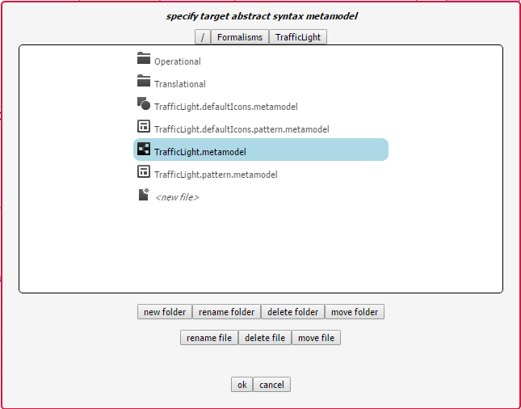

.. _creating-a-modelling-language:

Creating a Modelling Language
=============================

A new language needs two things: a definition its abstract syntax, and a definition of its concrete syntax. These are compiled to a formalism toolbar, which is used by the language user to create models (see :ref:`using-a-modelling-language`).

Initializing
------------

To initialize a new formalism, press the *new formalism* (|newFormalism.icon|) button of the *MainMenu* toolbar.

    
This will open a window which allows you to choose the name of your new language. In this case, we demonstrate using the *TrafficLight* language.

Pressing the OK button creates the following file structure under the */Formalisms/* user folder::
    
    TrafficLight/
        TrafficLight.model
        TrafficLight.metamodel
        TrafficLight.defaultIcons.model
        TrafficLight.defaultIcons.metamodel
        OperationalSemantics/
            T_OperationalSemantics.model
        DenotationalSemantics/
            T_DenotationalSemantics.model

* **TrafficLight.model** is the model of the language's abstract syntax (see :ref:`defining-abstract-syntax`)
* **TrafficLight.metamodel** is the compiled metamodel of the language's abstract syntax
* **TrafficLight.defaultIcons.model** is the definition of the language's concrete syntaxc (see :ref:`defining-concrete-syntax`)
* **TrafficLight.defaultIcons.metamodel** is the compiled definition of the language's concrete syntax (a formalism toolbar - see :ref:`formalism-toolbars`)
* **OperationalSemantics/T_OperationalSemantics.model** is the definition of the language's operational semantics (see :ref:`modelling-a-model-transformation`)
* **DenotationalSemantics/T_DenotationalSemantics.model** is the definition of the language's operational semantics (see :ref:`modelling-a-model-transformation`)

It then opens **TrafficLight.model** and **TrafficLight.defaultIcons.model** in new instances (tabs) of AToMPM. At the start, they are empty. Read the following sections to define your abstract syntax and concrete syntax.

.. _defining-abstract-syntax:

Defining Abstract Syntax
------------------------

When first opening the model of your formalism's abstract syntax (**<formalism-name>.model**), it is empty, with one formalism toolbar loaded: |SCDToolbar| (*/Formalisms/__LanguageSyntax__/SimpleClassDiagram/SimpleClassDiagram.umlIcons.metamodel*). *SimpleClassDiagram* is a *metamodelling* language and can be used to define the abstract syntax of a new language.

.. |SCDToolbar| image:: img/SCDToolbar.png
    :class: inline-image
    
It defines the following concepts:

* **Class** allows to model the structure of a concept in the language
* **GlobalConstraint** allows to model a constraint that needs to hold for each model conforming to this class diagram
* **GlobalAction** allows to model an action that is triggered on a specific trigger

Classes can be connected by two connectors:

* **Association**: allows to link instances of the source class with instances of the target class
* **Inheritance**: the source class inherits all attributes, actions, constraints, associations, and cardinalities (transitively) from the target class

.. note:: Many tools hide the definition of their metamodelling language(s), instead relying on a hardcoded core language. AToMPM, as much as possible, follows the philosophy of *modelling everything*. If you're interested, you can inspect the definition of the abstract and concrete syntax of any language in AToMPM, including *SimpleClassDiagram*. Open */Formalisms/__LanguageSyntax__/SimpleClassDiagram/SimpleClassDiagramMM.model* for the definition of *SimpleClassDiagram*'s abstract syntax, and */Formalisms/__LanguageSyntax__/SimpleClassDiagram/SimpleClassDiagram.defaultIcons.model* for the definition of *SimpleClassDiagram*'s concrete syntax.

Requirements
^^^^^^^^^^^^
A language has requirements. In case of *TrafficLight*, the requirements are as follows:

* A model in the *TrafficLight* language consists of a number of states. Each state has a unique name (a string). Exactly one of the states is a start state. There is no explicit end state, but a traffic light will stay forever in a state without outgoing transitions.
* States may be connected by zero or more transitions. There are two types of transitions: timed transitions and interrupt transitions. A timed transition is labelled with an integer number (milliseconds) time delay. An interrupt transition is labelled with the name of an interrupt (a string). There should be at most one timed transition going from a state. This is reasonable as our transitions do not have guards (as Statecharts do). If we allowed more than one timed transition, only the one with the lowest time delay would be used. All interrupt names on transitions going out of a single state must be distinct. If this were not the case, the behaviour (described in a later exercise) would be non-deterministic.
* Associated with each state is a description of the visualization of the traffic light when it is in that state. The description specifies, for each of the three coloured lights (Red, Green, Yellow) in a traffic light, whether it is on or off. A state "red" for example may have the visualization {Red=on, Green=off, Yellow=off} associated with it.
* Multiple states may refer to the same visualization.
* AToMPM does not allow for real-time simulation, nor external input. This means the interrupt-producing environment in which the traffic light will operate needs to be modelled too. This is done by means of a time-ordered interrupt list. The interrupt list consists of a number of connected interrupt notices. The list is single-linked, so each element is linked only to the next element in the list. An interrupt notice (*i.e.*, each element of the list) has a non-negative integer absolute time (milliseconds) timestamp as well as the name of the interrupt (a string).
* For simulation purposes only, a (singleton) global time entity holding a non-negative integer absolute time (milliseconds) value is needed. This value should be initialized to 0 and will only be updated (increased) by the simulator (operational semantics).
* Also for simulation purposes, a current state will refer to the state the model is in at any given time.

These requirements are translated to the class diagram model defining the language's abstract syntax. The *TrafficLights* abstract syntax definition is shown below.

In the next subsections, we go into detail what each element means.

.. _classes:

Classes
^^^^^^^
A class represents a concept in the language that can be instantiated on the canvas, if it is non-abstract. Abstract classes cannot be instantiated. In the *TrafficLight* language, one class called *AbstractInterrupt* is abstract, and has two subclasses: an *Interrupt* and an *End* of the interrupt list. Because the *Interrupt* list has an association *Nex* with *AbstractInterrupt*, a linear list of interrupts modelling the environment can be modelled, that ends with an *End* instance, since that class has no incoming or outgoing associations.

A traffic light model consists of, besides an interrupt list, *State*s, which are associated with a *Visualization*. States can be connected by transitions, that define conditional transitions. Let us look at the definition of the *State* class (by middle-clicking on its icon, or selecting it and clicking *insert* or the *command* key):

A class has six attributes:

* A (diagram-wide unique) *name* that identifies it.
* A number of :ref:`attributes`.
* A number of :ref:`constraints`.
* A number of :ref:`actions`.
* A number of :ref:`cardinalities`.
* A boolean indicating whether the class is abstract.

.. _associations:

Associations
^^^^^^^^^^^^
Associations connect classes. In models created in the language, they are instantiated as links between objects. Associations are the only way to refer from one object to another object (attributes can only be of primitive types!). There are two types of associations, which result in different behaviour when using the language:

* **Visual** associations are instantiated by right-clicking on the source object, dragging acrsoss the canvas, and releasing on the target object. This results in a visual link between the two objects.
* **Containment** associations are instantiated by dragging the source object on top of the target object, and releasing. This will automatically instantiate the containment association.

An *Association* in the abstract syntax definition is itself visual association. It is created by right-clicking a source class, and releasing on the target class. The definition of the *TimedTransition* association can be seen below:

An association has six attributes:

* A (diagram-wide unique) *name* that identifies it.
* A number of :ref:`attributes`.
* A number of :ref:`constraints`.
* A number of :ref:`actions`.
* A number of cardinalities, but these are unused, as AToMPM does not support hyperedges.
* A linktype that specifies whether this is a visual or a containment relationship.

If a user draws a link between two objects, and those object's classes are connected by more than one association, the user is presented with an option screen. If the classes are only connected by one associtation, that association is instantiated. If no association exists between the classes, no link is created. For example, when linking two *State* instances, the user is presented with the following screen:

... since in the metamodel, two associations connect the *State* class with itself.

.. _cardinalities:

Cardinalities
^^^^^^^^^^^^^
Cardinalities are constraints on the number of links that can be instantiated in the models created in the language. Cardinalities are defined on the source and target classes of the association for which we want to constrain the amount of instances. A cardinality is a dictionary with the following keys:

* **dir** is either *in* or *out*, depending on whether we want to constrain the amount of incoming or outgoing connections, respectively.
* **type** is the type (name of the association) of links we want to constrain.
* **min** is the minimum amount of incoming/outgoing links of the specified type (an integer 0 <= n < "inf").
* **max** is the maximum amount of incoming/outgoing links of the specified type (an integer 0 < n <= "inf").

.. _attributes:

Attributes
^^^^^^^^^^
A class or association can have attributes. These attributes are represented by a dictionary with three keys:

* **name** specifies the (unique within the class) name of the attribute.
* **type** specifies the type of the attribute. Supported types:
    * *int*: an integer
    * *float*: a floating-point number
    * *string*: a string
    * *boolean*: a boolean
    * *code*: a block of code
    * *file<pattern>*: a string which specifies the locatation of a file (such as a model). Attribute values have to match the specified pattern.
    * *map<[keys...],[base-types...]>*: a dictionary with specified keys, and for each key, a value of the specified base-type.
    * *list<base-type>*: a list of base-type values.
    * *ENUM(options...)*: a choice of several options.
    * *$ATTRIBUTE*: *map<[name,type,default],[string,string,string]>*
    * *$CARDINALITY*: *map<[dir,type,min,max],[string,string,string,string]>*
    * *$EVENT*: *ENUM(pre-connect,pre-create,pre-disconnect,pre-delete,pre-edit,post-connect,post-create,post-disconnect,post-delete,post-edit)*
    * *$EVENT_HANDLER*: *map<[name,event,code],[string,$EVENT,code]>*	
    * *$ARG*: *map<[name,type],[string,string]>*	
    * *$METHOD*: *map<[name,args,returntype,body],[string,list<$ARG>,string,code]>*
* **default** specifies the default value of the attribute.

.. warning:: Default values need to evaluate to values that are of the specified type!

.. warning:: When defining a map/ENUM, its keys/options are defined as a comma-separated list. Do NOT insert any whitespaces before or after the comma's, as these will be seen as part of the key/option name.

Depending on the type, the editor presented to the user is different. For an int/float/string it is an input field, for code a text area, for a file the user is presented with a file browser, etc.

.. _inheritance:

Inheritance
^^^^^^^^^^^
Two classes can be linked by :ref:`associations`, but also by an inheritance link. In the *TrafficLights* example, for example, *Interrupt* and *End* inherit from *AbstractInterrupt*. A subclass inherits :ref:`attributes`, :ref:`actions`, :ref:`constraints`, and :ref:`cardinalities` from its superclass. If the subclass defines any item with the same name, it overwrites the definition found in the parent.

.. _constraints:

Constraints
^^^^^^^^^^^
There are two types of constraints: global constraints (instantiated from the *SimpleClassDiagram* toolbar) and local constraints (in the definition of a class). They differ only in what they can "see": a global constraint is defined over the whole model, while a local constraint is evaluated in the context of an object, and can only "see" the object's structure and its neighbors.

A constraint is evaluated when an event triggers. An explanation of all triggers can be found under :ref:`triggers`.

A constraint needs to evaluate to a boolean value. The constraint code is written in Javascript. This means **the last statement executed by the constraint needs to evaluate to a boolean value**. For example, let's model the constraint that only one instance of the *Time* class can be instantiated.

As a local constraint:

.. warning:: Multi-line local constraints need to have each line end with "\\".

One disadvantage of this constraint is that the minimum number of instances (also 1) is not checked. A global constraint solves this:

This constraint checks, when the user presses the *validate* button on the *MainMenu* toolbar, whether exactly one instance of the *Time* class is instantiated. For more information on which functions are available, see :ref:`action-library`.

.. _actions:

Actions
^^^^^^^
There are two types of actions: global actions (instantiated from the *SimpleClassDiagram* toolbar) and local actions (in the definition of a class). They differ only in what they can "see": a global action is defined over the whole model, while a local action is evaluated in the context of an object, and can only "see" the object's structure and its neighbors.

An action is evaluated when an event triggers. An explanation of all triggers can be found under :ref:`triggers`.

For example, let's model an action that sets the *clock* attribute of a *Time* instance to 0 whenever a *Time* instance is created. Note that this is not really necessary, as the default value already makes sure the attribute is correctly initialized.

As a local action:

.. warning:: Multi-line local actions need to have each line end with "\\".

As a global action:

One major disadvantage of the global action is that the clock will be set to 0 every time an instance is created, regardless of its type.

.. _triggers:

Triggers
^^^^^^^^
The events that can trigger are:

* **pre-connect**, which triggers just before two instances are connected
* **pre-create**, which triggers just before an instance is created
* **pre-disconnect**, which triggers just before a link between two instances is deleted
* **pre-delete**, which triggers just before an instance is deleted
* **pre-edit**, which triggers just before an instance is edited
* **post-connect**, which triggers just after two instances are connected
* **post-create**, which triggers just after an instance is created
* **post-disconnect**, which triggers just after a link between two instances is deleted
* **post-delete**, which triggers just after an instance is deleted
* **post-edit**, which triggers just after an instance is edited
* **verify**, which triggers when the user presses the *verify* button on the *MainMenu* toolbar

.. note:: A constraint/action with no defined triggers will execute on the *verify* event. These constraints/actions should be updated to select the event explicitly.

.. _action-library:

Action Library
^^^^^^^^^^^^^^

.. rst-class:: table-with-borders

+---------------------------------+-------------------------------------+-------------------------------------------------------------------------------+
| name                            | parameters                          | Description                                                                   |
+=================================+=====================================+===============================================================================+
| getAttr(_attr[, _id])           | * *_attr*: string                   | Return the value of the given attribute from the given entity, specified      |
|                                 | * *_id*: string                     | via its abstract syntax identifier. If no such attribute exists, the          |
|                                 |                                     | current constraint, action, mapper, or parser is immediately interrupted      |
|                                 |                                     | and an error is presented to the user.                                        |
+---------------------------------+-------------------------------------+-------------------------------------------------------------------------------+
| hasAttr(_attr[, _id])           | * *_attr*: string                   | Returns *true* if the given entity, specified via its abstract syntax         |
|                                 | * *_id*: string                     | identifier, has an attribute named *attr*, *false* otherwise.                 |
+---------------------------------+-------------------------------------+-------------------------------------------------------------------------------+
| getAttrNames(_id)               | * *_id*: string                     | Return all attribute names of the given entity, specified via its abstract    |
|                                 |                                     | syntax identifier.                                                            |
+---------------------------------+-------------------------------------+-------------------------------------------------------------------------------+
| getAllNodes(_fulltypes)         | * *_fulltypes*: list<string>        | Return the abstract syntax identifiers of all entities whose types are        |
|                                 |                                     | contained within the fulltypes array. If it is omitted, return the abstract   |
|                                 |                                     | syntax identifiers of all entities. The notion of full types is best          |
|                                 |                                     | explained by example: the full type of a SimpleClassDiagram.Class entity is   |
|                                 |                                     | "/Formalisms/__LanguageSyntax__/SimpleClassDiagram/SimpleClassDiagram/Class". |
+---------------------------------+-------------------------------------+-------------------------------------------------------------------------------+
| getNeighbors(_dir[, _type, _id])| * *_dir*: string                    | Return neighbours of the given entity, specified via its abstract syntax      |
|                                 | * *_type*: string                   | identifier. The *_dir* parameter can take on three values: "in" implies that  |
|                                 | * *_id*: string                     | only inbound neighbours should be returned, "out" implies that only outbound  |
|                                 |                                     | neighbours should be returned, "*" implies that neighbours in either          |
|                                 |                                     | direction should be returned. Finally, the *_type* parameter can be set to    |
|                                 |                                     | indicate that only neighbours of the given full type should be re turned. The |
|                                 |                                     | notion of full types is best explained by example: the full type of a         |
|                                 |                                     | SimpleClassDiagram.Class entity is                                            |
|                                 |                                     | "/Formalisms/__LanguageSyntax__/SimpleClassDiagram/SimpleClassDiagram/Class". |
|                                 |                                     | To match any type, use "*".                                                   |
+---------------------------------+-------------------------------------+-------------------------------------------------------------------------------+
| print(msg)                      | * *msg*: string                     | Print the given string to the console that launched the AToMPM back-end.      |
+---------------------------------+-------------------------------------+-------------------------------------------------------------------------------+
| setAttr(_attr, _val[, _id])     | * *_attr*: string                   | Update the given attribute of the given entity, specified via its abstract    |
|                                 | * *_val*: any                       | syntax identifier, to the given value. Note that this function is only        |
|                                 | * *_id*: string                     | available from within meta-modelling actions. Also, beware the fact that      |
|                                 |                                     | calls to *setAttr()* are not treated like normal model updates (*i.e.*, they  |
|                                 |                                     | do not trigger pre-editing constraints and post-editing actions).             |
+---------------------------------+-------------------------------------+-------------------------------------------------------------------------------+

.. warning:: The *getNeighbors* returns only DIRECT neighbors. For instances of classes, this means its neighbors are *links* (instances of associations), and not the instances of classes that the instance is connected with through these links. A link always has exactly one incoming and one outgoing neighbor.

.. _defining-concrete-syntax:

Defining Concrete Syntax
------------------------

The concrete syntax definition of a language is a model in the */Formalisms/__LanguageSyntax__/ConcreteSyntax.defaultIcons.metamodel* language. It defines for each non-abstract class and association a visual icon.

There are two "main" classes: **Icon** and **Link**. The first is a container for visual elements that make up the visualization of a class instance. The second is a definition of the visualization of an association instance (an arrow). For example, this is the definition of the concrete syntax of the *TrafficLights* language:

.. warning:: Naming is very important. The *typename* attribute of an icon needs to be *<class-name>*Icon, where *<class-name>* is the name of the class, and the *typename* attribute of a link needs to be *<association-name>*Link, where *<association-name>* is the name of the association.

.. note:: For Icons, place its contents as close as possible to the top-left corner. This ensures that the icon is instantiated as close as possible to the mouse position.

*Icon* and *Link* contents are modelled as instances of eight classes:

#. *Rectangle*
    * *width* defines the width (in pixels).
    * *height* defines the width (in pixels).
    * *cornerRadius* defines the amount of rounding of the corners (as a percentage).
#. *Text*
    * *textContent* defines the text content of the text element.
#. *Circle*
    * *r* defines the readius of the instantiated rectangle (in pixels).
#. *Ellips*
    * *rx* defines the radius on the x-axis (in pixels).
    * *ry* defines the radius on the y-axis (in pixels).
#. *Polygon*
    * *r* defines the radius (in pixels).
    * *sides* defines the amount of sides.
#. *Star*
    * *r* defines the radius (in pixels).
    * *rays* defines the amount of rays.
#. *Path*
    * *segments* defines the segments of the path -- this allows for arbitrary shapes using the `SVG Paths <https://www.w3.org/TR/SVG/paths.html>`_ syntax.
#. *Image*
    * *src* specifies where the image can be found. This is a path relative to your user folder. It is recommended to put your images in your formalism folder (for example */Formalisms/<FormalismName>/images/*).
    * *width* defines the width of the image (in pixels).
    * *height* defines the width of the image (in pixels).
    
.. warning:: Scaling your elements with the geometry controls does not affect the size of the instantiated elements! You need to change the *width*/*height*/*r*/*rx*/*ry* attributes (depending on the element).

Mappers and Parsers
^^^^^^^^^^^^^^^^^^^
All visual elements have a number of attributes that change its appearance. For example, a circle has a radius that can be changed to resize it. But, you might want to make the values of concrete syntax attributes depend on the values of abstract syntax attributes, and vice versa, make the values of abstract syntax attributes depend on the value of concrete syntax attributes.

For example, a class might have a "name" attribute. It makes sense to include a *Text* instance in the icon definition for that class, but normally, the text content is fixed. Mappers make it possible to map the content of the name on the content of the text visual element. Converesely, let's say we want to access the position of an element in abstract syntax. Normally, the position attribute is only a concrete syntax attribute. Parsers make it possible to parse the content of the position attribute and change the abstract syntax attribute.

For the *TrafficLights* attribute, the icon of the *State* class consists of a circle and a text, which should display the name of the state. The definition of the text element is as follows:

Conversely, if the content of the text is changed, it is parsed as the name of the *State* instance.

More complex mappers are possible. The visualization of a traffic light consists of an oval with three circles: the top is the red light, the middle the yellow light, and the bottom the green light. Depending on the abtract syntax attributes, each light is either grey or its proper color. The definition of the mapper for the red circle looks like this:

No parser is defined, as it is not possible to change the style of the concrete syntax element without changing the abstract syntax.

Compiling
---------

Both the abstract syntax definition and the concrete syntax definition need to be compiled before they can be used as a language. To do this, we use the compilation toolbar:

To compile your abstract syntax, make sure the current active model is the abstract syntax definition of your language, and press the second button. This will display a file browser. Browse to the location of your language and choose the *<formalism-name>.metamodel* file as a target. For the *TrafficLights* example:

To compile your concrete syntax, make sure the current active model is the concrete syntax definition of your language, and press the first button. This will display a file browser. Browse to the location of your language and choose the *<formalism-name>.defaultIcons.metamodel* file as a target. For the *TrafficLights* example:

Each time you make a change to your abstract or concrete syntax, recompile them before using them.
