.. _overview:

Overview
========
This section presents an overview of AToMPM's user interface: how to create an account, and the different parts of the user interface (toolbars, canvas, and console).

First Usage
-----------
When first opening the user interface at http://localhost:8124/atompm (or a remote AToMPM server), the user is presented with a login screen.

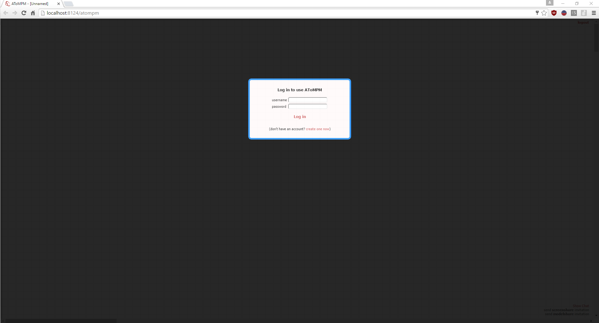

Click the *create one now* link, which will allow you to create a new account with a user name and password. Fill out the form and click *Create new account*.

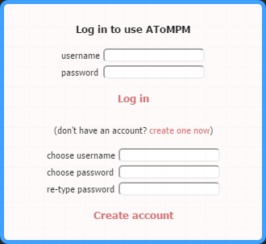

AToMPM will initialize the account (by creating a user folder under the `users/` folder) and switch to the main user interface view. When you revisit the AToMPM webpage or create a new AToMPM instance, the tool will remember your username and password and automatically log you in. You can log out by clicking the *logout* link at the top right of the user interface.

The AToMPM User Interface
-------------------------

When logged in, the AToMPM user interface is initialized with four button toolbars: *MainMenu*, *CompileMenu*, *TransformationController*, and *TransformationEditor*. They allow a langugage developer and a language user to perform most activities and are heavily used in the next sections of the documentation.

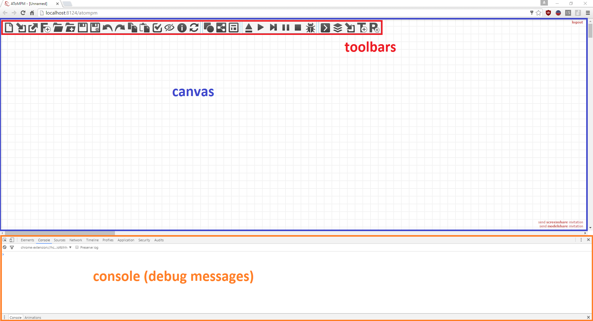

The user interface of AToMPM consists of three areas, which are explained in more details in the next sections. First is the *toolbar area* (also termed the *dock*), which contains the button and formalism toolbars. Second is the *canvas area* which displays the elements of the current model. Finally, there is the *console*, which may also appear in a separate window.

Toolbars
^^^^^^^^
There are two types of toolbars that can be loaded: button toolbars consist of a number of buttons that each perform a certain action, while formalism toolbars allow to instantiate language elements. A new toolbar can be loaded using the **(re)load a toolbar** button of the *MainMenu* toolbar. Toolbar models that can be loaded either have the *.buttons.model* extension (for button toolbars) or the *.metamodel* extension (for formalism toolbars).

Button Toolbars
"""""""""""""""
All button toolbar models can be found under the */Toolbars/* user folder. A button toolbar consists of a number of buttons that, when clicked, execute a particular action. Four button toolbars are loaded by default, explained below.

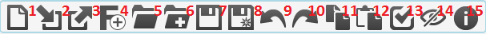
    
#. Launch a new AToMPM user interface in a new tab.
#. (Re-)open a button or formalism toolbar.
#. Close an opened toolbar. If this is a formalism toolbar, the model elements conforming to that formalism are removed from the model.
#. Create a new formalism under the */Formalisms/* user folder with the given name.
#. Open a model.
#. Insert the elements of a model into the currently opened model.
#. Save current model.
#. Save current model as...
#. Undo the last performed action.
#. Redo the last undone action.
#. Copy the selected elements on canvas.
#. Paste the copied elements on the canvas (copy/paste also works across AToMPM tabs).
#. Verify whether the constraints of the current model are satisfied.
#. Show or hide entities of a particular formalism (but do not remove them from the model).
#. Display information about AToMPM, such as the current version, website, and documentation.

Most of these actions are intuitive. Others are explained in more detail in the next sections.
    
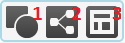
    
#. Compile the current model (conforming to the *ConcreteSyntax* formalism) to a formalism toolbar.
#. Compile the current model (conforming to the *SimpleClassDiagram* formalism) to a metamodel.
#. Compile a metamodel to a pattern metamodel (and associated formalism toolbar(s)), used in model transformation rules.

More information on these buttons can be found in :ref:`creating-a-modelling-language` and :ref:`modelling-a-model-transformation`.
    
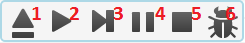
    
#. Load a transformation.
#. Run the currently loaded transformation until the end.
#. Execute one step of the currently loaded transformation.
#. Pause the running transformation.
#. Stop the running transformation.
#. Enable debugging, which opens a debug window when the transformation is executed that shows the transformation schedule and highlights the currently executing step.

More information on these buttons can be found in :ref:`executing-a-model-transformation`.
    

    
#. Open a rule model.
#. Open a transformation model.
#. Open a formalism toolbar of a pattern metamodel.
#. Create a new transformation model, and open it in a new tab.
#. Create a new rule model, and open it in a new tab.

More information on these buttons can be found in :ref:`modelling-a-model-transformation`.

.. _formalism-toolbars:

Formalism Toolbars
""""""""""""""""""
Loading a formalism toolbar allows you to create elements on the canvas conforming to that formalism. Multiple formalism toolbars can be loaded, which allows a model to contain elements conforming to multiple formalisms.

As an example, we show the formalism toolbar of the *TrafficLight* language, which is used throughout the readme as an example.

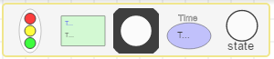

Each button of a formalism toolbar corresponds to an icon in the concrete syntax definition of the formalism. Links are not shown. Clicking a button will select that particular type to be instantiated. Right-clicking on the canvas instantiates the icon on the canvas. More information on how to use a formalism toolbar to model can be found in :ref:`using-a-modelling-language`.

Canvas
^^^^^^
Below is a list of various states the Canvas can be in along with lists of actions available in each state and their corresponding shortcut(s).

When in the **DEFAULT** state,

.. rst-class:: table-with-borders

+---------------------------------+-----------------------------------------------------------------------------+
| Action                          | Shortcut(s)                                                                 |
+=================================+=============================================================================+
| Choose an entity type to create | Left-click on desired type from a loaded formalism toolbar.                 |
+---------------------------------+-----------------------------------------------------------------------------+
| Create an entity                | Right-click anywhere on the canvas.                                         |
+---------------------------------+-----------------------------------------------------------------------------+
| Select an entity                | Left-click any entity. This will also select the entity's contents, if      |
|                                 | any. To select a container without selecting its contents, SHIFT-Left-click |
|                                 | it. Enters the **SOMETHING SELECTED** state.                                |
+---------------------------------+-----------------------------------------------------------------------------+
| Select one or more entity       | Left-press anywhere on Canvas, drag selection box around desired            |
|                                 | entity or entities and release. Enters the **SOMETHING SELECTED** state.    |
+---------------------------------+-----------------------------------------------------------------------------+
| Connect entities                | Right-press an entity (enters the **DRAWING EDGE** state), drag to-be edge  |
|                                 | to target entity and release.                                               |
+---------------------------------+-----------------------------------------------------------------------------+
| Edit icon text                  | SHIFT-Middle-click any text from any icon on the Canvas (this               |
|                                 | will display a very simple text editor).                                    |
+---------------------------------+-----------------------------------------------------------------------------+
| Edit entity                     | Middle-click or SHIFT-Left-click any entity on the Canvas (this will        | 
|                                 | display the attribute editor).                                              |
+---------------------------------+-----------------------------------------------------------------------------+

The attribute editor is shown in the image below. In the editor, TAB changes focus to the next text entry. The ENTER key will accept the changes and close the editor window in most cases. However, pressing ENTER in a multi-line text area will produce a newline within the text.

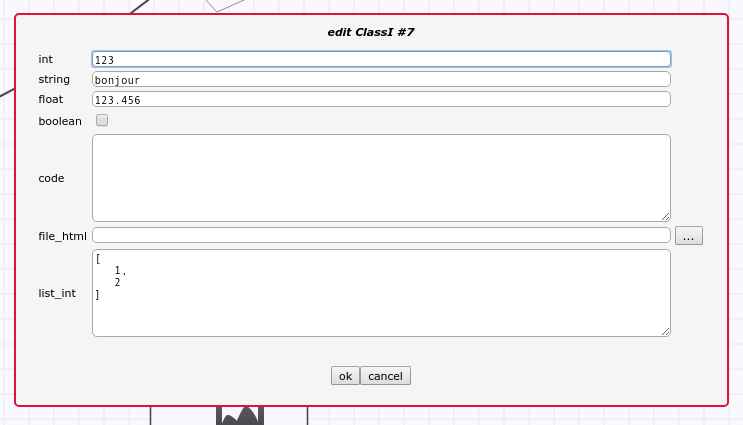

When in the **SOMETHING SELECTED** state (*i.e.*, when one or more entity is selected).

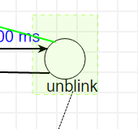
    

.. rst-class:: table-with-borders

+--------------------------------------+-----------------------------------------------------------------------------+
| Action                               | Shortcut(s)                                                                 |
+======================================+=============================================================================+
| Unselect selection                   | Right-/Left-/Middle-click anywhere on the Canvas, or click ESC. Enters the  |
|                                      | **DEFAULT** state.                                                          |
+--------------------------------------+-----------------------------------------------------------------------------+
| Move selection                       | Left-press selection, drag preview overlay to desired position and          |
|                                      | release. Enters the **DEFAULT** state.                                      |
+--------------------------------------+-----------------------------------------------------------------------------+
| Delete selection                     | Press DELETE. Enters the **DEFAULT** state.                                 |
+--------------------------------------+-----------------------------------------------------------------------------+
| Edit first entity in selection       | Press INSERT, or click COMMAND (this will display the attribute editor).    |
+--------------------------------------+-----------------------------------------------------------------------------+
| Change the geometry of the selection | Press CTRL. Enters the **GEOMETRY EDITING** state.                          |
+--------------------------------------+-----------------------------------------------------------------------------+
| Edit the selected edge               | Press SHIFT. Enters the **EDGE EDITING** state.                             |
+--------------------------------------+-----------------------------------------------------------------------------+
| Snap selection to nearest grid point | Press TAB. Enters the **DEFAULT** state.                                    |
+--------------------------------------+-----------------------------------------------------------------------------+

When in the **DRAGGING SELECTION** state (*i.e.*, when left-dragging one or more selected entity),

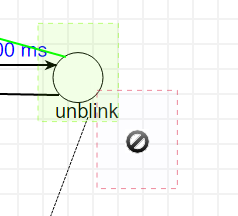

.. rst-class:: table-with-borders

+--------------------------------------+-----------------------------------------------------------------------------+
| Action                               | Shortcut(s)                                                                 |
+======================================+=============================================================================+
| Insert selection into container      | Left-release on top of the target entity. Enters the **DEFAULT** state.     |
+--------------------------------------+-----------------------------------------------------------------------------+
| Remove selection from container      | Left-release outside of current container. Containment relationships can    |
|                                      | also be deleted manually if visible. Enters the **DEFAULT** state.          |
+--------------------------------------+-----------------------------------------------------------------------------+
| Confirm motion                       | Left-release on the Canvas. Enters the **DEFAULT** state.                   |
+--------------------------------------+-----------------------------------------------------------------------------+
| Cancel motion                        | Click ESC. Enters the **DEFAULT** state.                                    |
+--------------------------------------+-----------------------------------------------------------------------------+

When in the **DRAWING EDGE** state (*i.e.*, when dragging to-be edge from source to target entities),

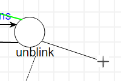

.. rst-class:: table-with-borders

+---------------------------------------+-----------------------------------------------------------------------------+
| Action                                | Shortcut(s)                                                                 |
+=======================================+=============================================================================+
| Make current line horizontal/vertical | Click TAB.                                                                  |
+---------------------------------------+-----------------------------------------------------------------------------+
| Create control point                  | Left-click anywhere, or click CTRL.                                         |
+---------------------------------------+-----------------------------------------------------------------------------+
| Delete last control point             | Middle-click anywhere, or click ALT.                                        |
+---------------------------------------+-----------------------------------------------------------------------------+
| Cancel current edge                   | Left-release anywhere on the Canvas. Enters the **DEFAULT** state.          |
+---------------------------------------+-----------------------------------------------------------------------------+

When in the **EDGE EDITING** state,

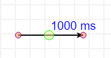

.. rst-class:: table-with-borders

+---------------------------------------+-----------------------------------------------------------------------------+
| Action                                | Shortcut(s)                                                                 |
+=======================================+=============================================================================+
| Move control point                    | Left-press any control point, drag it to desired position and release.      |
|                                       |                                                                             |
|                                       | If editing a control point attached to an icon, movement is restricted to   |
|                                       | within that icon's bounding box. If free movement is desired,               |
|                                       | hold CTRL while moving the control point.                                   |
+---------------------------------------+-----------------------------------------------------------------------------+
| Vertically/Horizontally align control | Left-click any control point and click TAB.                                 |
| point to previous control point       |                                                                             |
+---------------------------------------+-----------------------------------------------------------------------------+
| Clone control point                   | Right-click any control point.                                              |
+---------------------------------------+-----------------------------------------------------------------------------+
| Delete control point                  | Middle-click any control point (extremities and the central control         |
|                                       | point cannot be removed).                                                   |
+---------------------------------------+-----------------------------------------------------------------------------+
| Finish editing                        | Right-/Left-/Middle-click anywhere on the Canvas, or click ESC. Enters the  |
|                                       | **DEFAULT** state.                                                          |
+---------------------------------------+-----------------------------------------------------------------------------+

When in the **GEOMETRY EDITING** state,

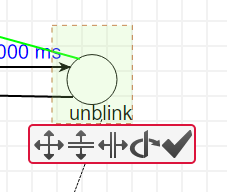

.. rst-class:: table-with-borders

+---------------------------------------+-----------------------------------------------------------------------------+
| Action                                | Shortcut(s)                                                                 |
+=======================================+=============================================================================+
| Scale                                 | Mouse-wheel up/down on scale icon until preview overlay reaches desired     |
|                                       | shape.                                                                      |
+---------------------------------------+-----------------------------------------------------------------------------+
| Scale vertically only                 | Mouse-wheel up/down on vertical scale icon until preview overlay reaches    |
|                                       | desired shape.                                                              |
+---------------------------------------+-----------------------------------------------------------------------------+
| Scale horizontally only               | Mouse-wheel up/down on horizontal scale icon until preview overlay reaches  |
|                                       | desired shape.                                                              |
+---------------------------------------+-----------------------------------------------------------------------------+
| Rotate                                | Mouse-wheel up/down on rotation icon until preview overlay reaches desired  |
|                                       | shape.                                                                      |
+---------------------------------------+-----------------------------------------------------------------------------+
| Cancel changes                        | Right-/Left-/Middle-click anywhere on the Canvas, or click ESC. Enters the  |
|                                       | **DEFAULT** state.                                                          |
+---------------------------------------+-----------------------------------------------------------------------------+
| Confirm changes                       | Left-click confirmation icon. Enters the **DEFAULT** state.                 |
+---------------------------------------+-----------------------------------------------------------------------------+

Console
^^^^^^^

The developer console (press F12 in Chrome/Firefox) contains many useful debugging messages. Especially when :ref:`executing-a-model-transformation`, the console contains useful information on which rules were executed and whether they failed or succeeded.
    
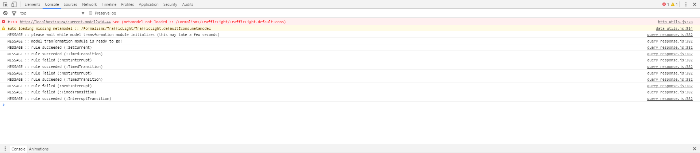

.. _userprefs:

Tweaking Default Settings
^^^^^^^^^^^^^^^^^^^^^^^^^

Several parameters can be tweaked for a more personalized user experience. Their meaning, range of possible values and defaults are detailed below:

+---------------------------------------+-----------------------------------------------------------------------------+-----------------------------+---------+
| Preference Key                        | Meaning                                                                     | Type                        | Default |
+=======================================+=============================================================================+=============================+=========+
| *autosave-delay*                      | The number of seconds between current model backups,                        | integer                     | 15      |
|                                       | or -1 to disable time-intervalled backups.                                  |                             |         |
+---------------------------------------+-----------------------------------------------------------------------------+-----------------------------+---------+
| *autosave-mode*                       | When set to \textit{overwrite}, automatic saving overwrites the             | ENUM(overwrite, backup)     | backup  |
|                                       | current model on disk (i.e., has the same effect as if you'd clicked        |                             |         |
|                                       | the save button from the MainMenu toolbar). When set to *backup*,           |                             |         |
|                                       | automatic saving saves the current model into a temporary file and          |                             |         |
|                                       | does \emph{not} overwrite the current model on disk.                        |                             |         |
+---------------------------------------+-----------------------------------------------------------------------------+-----------------------------+---------+
| *confirm-exit*                        | When set to \textit{true}, exiting or logging out while the current model   | boolean                     | true    |
|                                       | contains unsaved changes pops up a warning.                                 |                             |         |
+---------------------------------------+-----------------------------------------------------------------------------+-----------------------------+---------+
| *default-mt-dcl*                      |The default programming language for all code in model transformation rules. |  ENUM(JAVASCRIPT, PYTHON)   | PYTHON  |
+---------------------------------------+-----------------------------------------------------------------------------+-----------------------------+---------+
| *autoloaded-toolbars*                 | Toolbars to load when starting a new AToMPM client.                         | list of toolbar paths       | []      |
+---------------------------------------+-----------------------------------------------------------------------------+-----------------------------+---------+
| *autoloaded-model*                    | Model to load when starting a new AToMPM client.                            |  model path                 | ''      |
+---------------------------------------+-----------------------------------------------------------------------------+-----------------------------+---------+

