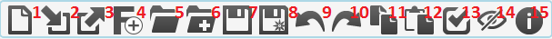

.. _using-a-modelling-language:

Using a Modelling Language
==========================

Using a modelling language is relatively easy, and requires you to make use of the *MainMenu* toolbar:

Loading a Formalism Toolbar
---------------------------
The first step when using a language is to load its associated formalism toolbar by pressing the second button on the *MainMenu* toolbar. You are presented with a file browser. To load the *TrafficLights* example, for example:

The toolbar allows you to place instances of classes on the canvas and connect them. For more information, see :ref:`formalism-toolbars`.

Opening a Model
---------------
To open a model, press the fifth button of the *MainMenu* toolbar. Opening a model replaces the currently opened model, if any. If there are any unsaved changes in the currently opened model, you will receive a warning.

Saving a Model
--------------
When you are done editing, you can save your model by pressing the seventh button on the *MainMenu* toolbar. If this is the first time you save a model, you will be presented with a file browser that allows you to choose a name for your model.

.. note:: Model names need to end with the .model file extension.

Validating a Model
------------------
To validate whether the structure of your model adheres to all constraints defined by the language, press the third-last button. If no message appears, it means all constraints are satisfied. Otherwise, a message appears detailing the constraint that failed. For example:

