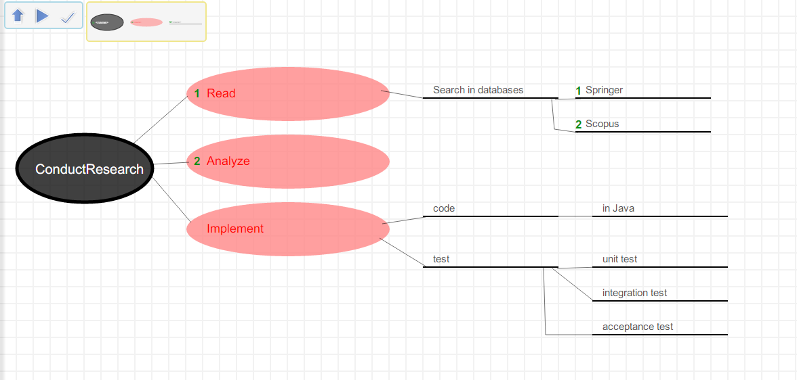

.. _workflows:

Workflows
================================
A Workflow is a modelling-driven engineering (MDE)-based solution where the user defines a "workflow" that can be parametrized at run-time and executed. This Workflow language is a domain-specific language (DSL) for defining activities that can be performed in MDE tools. In the next sections, we explain how to create and use these elements. 

An activity is composed of tasks, to define concrete actions to be performed. Our goal is to automate user’s activities as much as possible, therefore most of the tasks are automatic: they do not require human interaction. An example of this is loading a formalism to create a metamodel, since the location of that formalism can be set as a parameter.

An activity conforming to the metamodel starts from the initial node and terminates at the final node. Tasks can be sequenced one after the other.

Using Workflows
-----------------------------

Using a workflow is done with the *Workflow* toolbar:

There are three steps to enacting a workflow:

#. Load the template model for the  workflow you desire to enact.
#. Set the run-time parameters.
#. Execute the workflow.

Opening the workflow
---------------------

To open a Workflow, press the *OpenModel* button of the *MainMenu* toolbar, as described in :ref:`overview`. Opening a template model replaces the currently opened model, if any. If there are any unsaved changes in the currently opened model, you will receive a warning.

* Click on Open Model button.
* Select the template file
    * Sample workflows are found in *Formalism/Workflows/Templates…*.
* Select the file.
* Click on the OK button.

Setting the run-time parameters
---------------------------------

A pre-requisite to execute a workflow is to set the run-time parameters. These parameters are an explicit element within the template model. However, this element is not edited directly. Instead, a transformation is used to load the parameters into the element.

Press the *LoadParameters* button, the first button on the *Workflow* toolbar. This creates a dialog prompting for all required parameters for the template. Write the parameters and click on the OK button.

.. note:: Each parameter must be typed without extension, as the extension is pre-defined for each parameter by the designer of the template. Example: If the class diagram toolbar location is: "/Formalisms/__LanguageSyntax__/SimpleClassDiagram/SimpleClassDiagram.umlIcons.metamodel", then the parameter must be : "/Formalisms/__LanguageSyntax__/SimpleClassDiagram/SimpleClassDiagram.uml". In this case, "Icons.metamodel" has been pre-defined.

Execute the workflow
---------------------

Whenever you wish to continue with the workflow, click on the *Resume Process* button, the second button on the *Workflow* toolbar. This executes the worklow autonomously.

When a manual task is reached, a new AToMPM window is opened with all necessary toolbars pre-loaded. As well, a message describing the manual task to perform is displayed.

After completing the task, push the third button (*CompleteTask* button) on the *Workflow* toolbar so that the activity and window close. You should then be looking at the template model. Press the *Resume Process* button to continue with the workflow.

Dependency
-------------

Workflow parameters are specified once per workflow. However, run-time parameters may be shared between different tasks in the workflow. Therefore, a *Dependency* link can be specified between different tasks that share the same run-time parameters.

A dependency link specifies which attribute from the target task receives its value from an attribute in the source task. For example, consider the template in */Formalisms/Workflows/Templates/EditModel.model*. The location of the *SaveModel* task is the same as the location of the *OpenModel* task when saving a model we have just opened and modified. Therefore there is a dependency link between these tasks.

Example Workflow for Creating a DSL
-----------------------------------

This section will describe the workflow that specifies how to create a DSL and generate a modeling environment for it in AToMPM. This workflow template is found in */Formalisms/Workflows/Templates/CreateDSL.model*.

The *SaveMetamodel* and *SaveCS* tasks require filenames to save the models. This is done by setting the parameters, using the 
*LoadParameters* button as described above. This creates a dialog window for entering the parameters, as seen in the following figure.

.. note:: Recall that default extensions are appended to these parameters. Therefore, example values would be "TestMM" for the Save Metamodel location, and "Test.default" for the Save CS location.

    

The first task in the workflow is *LoadToolbar*. Its location parameter is already pre-defined with the class diagram toolbar, since this is the standard formalism for creating a meta-model in AToMPM.

The following task is *EditModel*. In this manual task, the user creates the meta-model of the DSL using class diagrams in a new AToMPM window, as shown in the figure below.

Once this is complete, the workflow resumes executing from that task and proceeds with the *SaveModel* task. This task requires a run-time parameter to specify the location of where the metamodel is saved.

Now that the metamodel is created, a fork node proposes two flows: one for creating the concrete syntax of the DSL and one to generate the abstract syntax from the metamodel. The workflow chooses one flow and then the other in no specific order.

Suppose the abstract syntax flow is chosen, on the bottom of the workflow model. The next task to be executed is therefore *GenerateAS*. The location parameter uses the same value of the location attribute of *SaveModel*, as depicted by the dependency link between these two tasks.

When the join node is reached, the simulation notices that the top flow has not been executed yet. Therefore, the concrete syntax flow is started.

A *LoadToolbar* task is executed to load the concrete syntax toolbar, the standard formalism in AToMPM. This is followed by an *EditModel* so the user can manually create the shapes of each element of the metamodel.

Once this is complete, the workflow restarts and proceeds with a *SaveModel* task. Again, the location is a run-time parameter to save the concrete syntax model with a pre-defined extension. The following task in this flow is *GenerateCS*.

The *GenerateCS* task takes as run-time parameter the location of where the generated artifact must be output. Specifically, the name used will be also the name of the toolbar that will be used to create a model with this DSL.

Therefore, the location of the generated concrete syntax is the same as the location of the concrete syntax model the user created manually. The dependency link allows this information to propagate through the workflow.

When the join node is reached again, this time all flows were executed. The workflow proceeds with the final task *LoadToolbar*.

The *LoadToolbar* location parameter refers to the location that the concrete syntax metamodel was saved to. The workflow ends with a new window open with the new domain-specific language loaded, ready for the creation of a new model.
